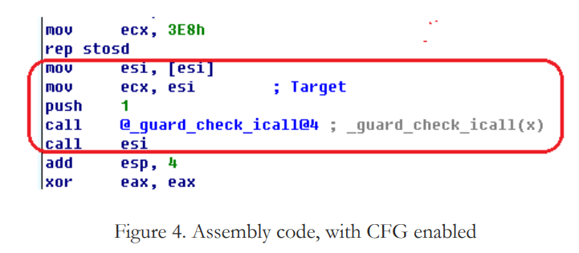

# Lets talk about Control Flow Guard now!

CFG is a mitigation technology to prevent control flow being redirected to unintended locations, 
by validating the target address of an indirect branch before it takes place. CFG ensures that the target address is a valid starting address.

It is also important to note that CFG only protects against **indirect calls**. Does not protect also stack return address corruption.

## Resources
1) https://paper.seebug.org/papers/Security%20Conf/Blackhat/2017_asia/asia-17-Sun-Never-Let-Your-Guard-Down-Finding-Unguarded-Gates-To-Bypass-Control-Flow-Guard-With-Big-Data.pdf
2) https://documents.trendmicro.com/assets/wp/exploring-control-flow-guard-in-windows10.pdf?_ga=2.153245688.153772636.1619702751-827707586.1619702751

## No CFG


## With CFG


If compiler-implemented, goes to a CF Function Table.

If OS implemented, goes to CFG Bitmap

Before the indirect call, the target address is passed to the _guard_check_icall function.
In Windows 10, it points to *ntdll!LdrpValidateUserCallTarget*.

This function takes a target address as argument and does the following:

1) Access a bitmap (*CFGBitmap*) which represents the **starting location of all the functions in the process space.** 

The status of every 8 bytes in the process space corresponds to a bit in *CFGBitmap*.

**What does the above sentence mean??? Does it map every address of the process space?**

Does it map every address of the process space onto the CFGBitMap?

2) Example address of 0x00b01030. The highest 3 bytes (0x00b010) is the offset for CFGBitmap while 
the last byte will give the value of X. 


Target address of 0x00b01030:
First 3 bytes gives the pointer to CFGBitMap (in blue)
Last byte gives X (in red)

```
Pointer to CFGBitMap = CFGBitmap + 0x00b010
```

3) Checks if target address is aligned with 0x10 (Target address & 0xF)

If its aligned, X is the bit offset value within the unit.

If not aligned, X | 0x1 is the bit offset value. ~~Isn't X | 0x1 always X?~~ (6 | 1 can be 7)

4) In this case, X = 6. Now using the pointer to CFGBitMap, we check the 6th bit.

Since the sixth bit, if it is 1, the indirect call target is a valid function address.
Else, invalid and trigger exception!!!

## New mitigations??? Return Flow Guard 
Protects overwriting return address on stack

## Questions/Doubts

1) How does the CFGBitMap correlate to the current calling function?

There is only mention of target address. 
 
Or does it only check if its a valid function starting address?

2) Still don't understand the line about status corresponding to a bit in CFGBitMap.

## Maybe it can be better explained if we look at some bypasses...

So effectively, if i buffer overflow, i cannot jump to my shellcode nor any ROP since it is not starting address of any function.

However, i can jump to any other function i want.

Also, if i corrupt return addresses on the stack, i can also bypass CFG!!!