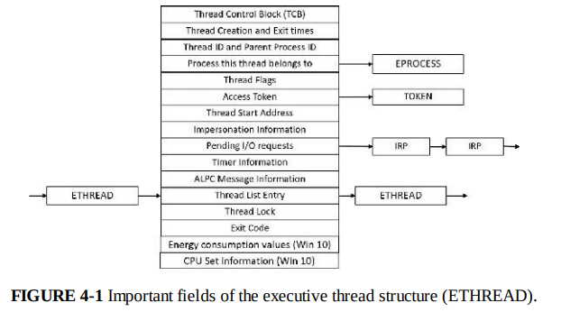

# Chapter 4 - Threads

## Things that I never knew

1) Optional stack size

2) CreateRemoteThread is a common technique for debugger to force a break in debugged process
	- Also use to obtain internal information about another process
	
3) CreateThread and CreateRemoteThread eventually calls CreateRemoteThreadEx and NtCreateThreadEx
	- NtCreateThreadEx will trainsit into kernel mode

4) Creating a thread in kernel mode is achieved with the PsCreateSystemThread (can create thread in ANY process)

5) Windows thread is represented by an executive thread object 
	- ETHREAD structure
	- KTHREAD structure
	
6) ETHREAD structure exists in system address space, while TEB exists in process address space

	- Interesting fields:
		1) Process this thread belongs to -> EPROCESS
		2) Access Token
		3) Pending I/O Requests points to IRP
		4) ETHREAD -> Thread List Entry -> ETHREAD
	
	- First member is called TCB (actually a structure of type KTHREAD)
	- ***Process Identification Information***
		- ***Stores a pointer to the owning process***

7) KTHREAD structure

	- Interesting fields:
		1) Dispatcher Header
		2) ***TEB (In Userland)***
		3) Wait Block
		4) List of pending APCs
		5) KTHREAD -> Thread List Entry -> KTHREAD
		
	- KTHREAD structure contains information that the windows kernel need to perform:
		1) Thread scheduling
		2) Synchronization
		3) Time-keeping

# Useful commands
1) dt nt!_ETHREAD
2) dt nt!_KTHREAD
3) !process 
	- !process 0 0 explorer.exe
	- !process ffffe00018C817C0 2 (This shows its thread)
4) !thread
5) !TEB
6) ~(tilde) (show all threads in the process)
7) dt ntdll!_teb {address}
***8) .thread /p {address} (Switches context to thread)***

